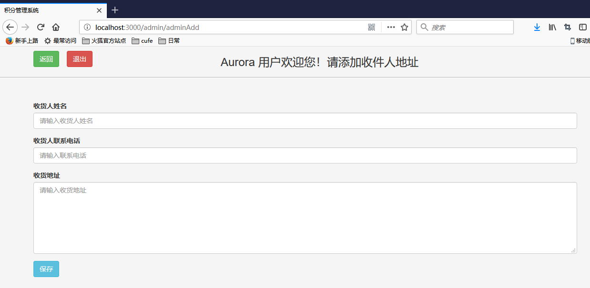
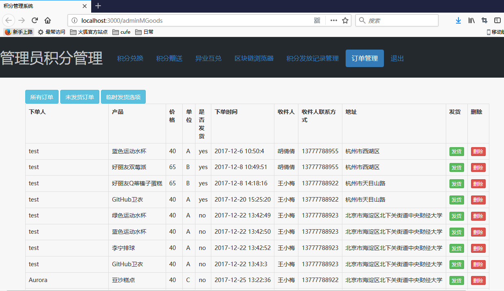

# 乐行积分管理系统说明
* 乐行积分管理系统分为2个部分：**用户登录使用模块** 和  **管理员登录使用模块**。用户模块主要是用户进行积分管理、交易等操作。管理员模块下，系统管理员可以进行发放积分、录入积分记录、更新订单信息等操作。
* 目前基本完成系统的设计开发，希望进行论文撰写的部分。分三个部分介绍一下系统。请老师过目(｡･ω･｡)ﾉ♡。
## 1. 系统架构

### 1.1 技术架构

​    以太坊 + Nodejs  + Express（web框架） + Solidity（代币合约） + MongoDB（存储用户、订单等信息）

* 其中网页图表是用encharts做的。
* 利用了MongoDB的mongoose工具操作数据库。
* 后台可以利用以太坊钱包部署合约，转账积分。

### 1.2 初步想法

（1）系统交易维护

​    部署多个以太坊节点，共同维护一个私链。部署代币合约，然后以恒定的算力进行挖矿。用户只需要访问系统网址，注册账户，进行交易等操作。其产生的交易都会被多个节点打包成块。

（2）系统业务运营

   业务运营初步设想有两种方式：

1. 积分发行方和系统运营方达成协议、价格，然后由系统运营方为用户提供商品发送等服务。
2. 积分发行方和系统运营方达成协议、价格，然后由系统运营方为积分发行发提供相应的系统管理员账户，由其管理员为用户提供商品发送等服务。

### 1.3 区块链技术架构的**优势** 

1. 数据备份。不会因为某个节点的失效而丢失积分数据。

2. 交易方便。积分在账户之间的流转、积分之间的相互兑换都很便捷。

3. 交易透明，便于审计，交易不可更改。

## 2. 用户登录使用模块

### 2.1 主界面

### 2.2 说明展示

#### 2.2.1 积分使用说明
由主界面点击“乐行积分使用说明”跳转到。

#### 2.2.2 常见问题说明
* 由主界面点击“常见问题”跳转到。

### 2.3 登录注册界面
* 由主界面点击“登录注册”跳转到。

* 点击“注册”跳转到。

#### 2.3.1 说明
* 这里每个登录后才能查看的界面都已经在代码层面做了访问控制。

* 对于用户输入的密码，在数据库中存储其 **sha1加盐** 后的值，提高了信息安全性。

* 用户的输入信息，也在后台用**正则** 的方式做了规则限制。

* 如果信息不正确，会返回错误提示。

  
#### 2.3.2 注册要求
* 注册要求用户填写默认收件人信息，这样兑换的商品可以寄给默认收件人地址。
* 在用户手册中提示用户，只有在注册以太坊账户之后才能公开自己的以太坊账户，便于转账赠送等操作。一个以太坊地址在数据库中只能注册一次。

### 2.4 积分兑换界面
登录后首先进入积分兑换界面。
* 左侧显示账户信息，包括账户的积分余额、收件人信息、账户名、头像等。

* 在积分兑换商城中进行商品兑换。**注意**：为了简化系统设计。这里暂定的规则是，一旦点击兑换，账户会自动减去相应金额，然后按照默认收件人地址寄送。

  

* 每类积分有其专属兑换列表。由上面的按钮可以快速到达商品列表。 

* 也存在通用积分列表，每样商品有不同积分的价格。

  ​                                                                               
### 2.5 积分赠送界面
积分赠送界面，可以填写接收方的以太坊账户，选择积分种类、数量进行转账。自己的以太坊账户在这里是不可更改的。
 
### 2.6 异业互兑界面
异业互兑界面，展示了该账户总资产价值比例的环形图。这里系统给定了积分之间的兑换比例。可以将某一类积分兑按照系统给出的比例换成另一类积分。
 
### 2.7 区块链浏览器界面
* 区块链浏览器界面，展示了前100个区块的信息。标红的该区块是打包交易的区块，打包了4个交易。

 

* 点击该记录，可以看到交易的详细信息。交易的发送方和接收方。

 

### 2.8 个人信息管理界面
 

* 在个人信息管理界面，可以添加收件人地址。

 

* 可以修改收件人地址信息。

 

### 2.9 订单管理界面
在订单管理界面，可以查看该账户的所有订单、未发货的订单记录。并加入了**分页功能**。
 
### 2.10 积分发放记录界面
* 积分发放记录界面，可以查看该账户不同积分的发放记录。也加入了**分页功能**。
* 对于行走积分，还加入了该用户全年每日行走步数的可视化模拟图。

 

### 2.11 退出
点击退出，返回主界面。

## 3. 管理员登录使用模块
在管理员登录界面进行登录。
 
### 3.1 积分发放记录管理界面
在积分发放记录管理界面，可以看到数据库中所有的积分发放记录。
 
### 3.1.1 增加积分发放记录
* 根据积分发放规则，增加不同用户的积分发放记录。
   
### 3.1.2 删除积分发放记录
* 也可以删除积分发放记录。配合在以太坊钱包中对积分进行转账即可。
### 3.2 订单管理界面
在订单管理界面，可以数据库中所有的订单记录。在发货后，将订单状态变为已发货，也可以删除订单。
 
### 3.3 退出
点击退出即退出系统，返回管理员登录界面。